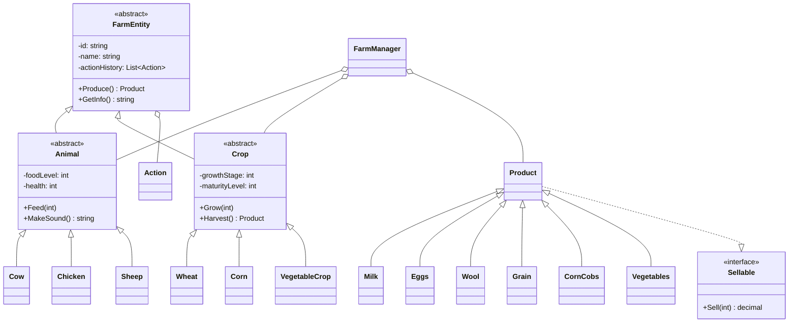

# 🚜 Farm Management System

<div align="center">


**A comprehensive C# application demonstrating Object-Oriented Programming principles through farm simulation**

[📚 Documentation](docs/design-document.md) • [🎯 Features](#-features) • [🚀 Quick Start](#-quick-start) • [📖 User Guide](docs/user-guide.md) • [🔧 API Reference](docs/api-reference.md)

</div>

---

## 📋 Table of Contents

- [Overview](#-overview)
- [Features](#-features)
- [OOP Principles Demonstrated](#-oop-principles-demonstrated)
- [Class Hierarchy](#-class-hierarchy)
- [Installation](#-installation)
- [Quick Start](#-quick-start)
- [Usage Examples](#-usage-examples)
- [Documentation](#-documentation)
- [Project Structure](#-project-structure)
- [Requirements Met](#-requirements-met)
- [Screenshots](#-screenshots)
- [Contributing](#-contributing)
- [License](#-license)
- [Author](#-author)

---

## 🌟 Overview

The **Farm Management System** is a console-based application built in C# that simulates comprehensive farm operations. This project serves as an educational demonstration of all core Object-Oriented Programming (OOP) principles including abstraction, encapsulation, inheritance, polymorphism, composition, and interfaces.

### 🎓 Educational Purpose

This project was created to demonstrate:
- ✅ Clean architecture and design patterns
- ✅ SOLID principles in practice
- ✅ Proper exception handling
- ✅ Real-world OOP application
- ✅ Best practices in C# development

---

## ✨ Features

### 🐄 Animal Management
- **Three animal types**: Cows, Chickens, Sheep
- **Health & food tracking**: Monitor animal wellbeing
- **Unique behaviors**: Each animal has distinct sounds and products
- **Production system**: Generate milk, eggs, and wool

### 🌾 Crop Cultivation
- **Three crop varieties**: Wheat, Corn, Vegetables
- **Growth simulation**: Track growth stages over time
- **Maturity system**: Harvest only when crops are ready
- **Variable yields**: Production based on growth quality

### 📦 Product & Inventory
- **Six product types**: Milk, Eggs, Wool, Grain, Corn Cobs, Vegetables
- **Inventory management**: Track all farm products
- **Sellable interface**: Unified selling mechanism
- **Profit tracking**: Monitor total farm earnings

### 📊 Tracking & Reporting
- **Action history**: Complete audit trail of all farm activities
- **Comprehensive reports**: Detailed farm status displays
- **Transaction logs**: Track all productions, harvests, and sales
- **Statistics**: View day count, total profit, and resource counts

### ⏰ Time Simulation
- **Day advancement**: Simulate passage of time
- **Automatic events**: Animals lose food, sheep grow wool
- **Dynamic system**: Farm state evolves over time

---

## 🏗️ OOP Principles Demonstrated

### 1️⃣ Abstraction
```csharp
public abstract class FarmEntity
{
    public abstract Product Produce();
    public abstract string GetInfo();
}
```
- Abstract base class `FarmEntity` defines common interface
- Abstract classes `Animal` and `Crop` provide templates
- Forces concrete implementations in derived classes

### 2️⃣ Encapsulation
```csharp
private int foodLevel;
public int FoodLevel => foodLevel;

public void Feed(int amount)
{
    if (amount <= 0)
        throw new InsufficientFoodException("Feed amount must be greater than 0");
    foodLevel = Math.Min(MAX_FOOD, foodLevel + amount);
}
```
- All fields are **private**
- Controlled access through **properties** and **methods**
- **Validation** on all inputs
- Data integrity maintained

### 3️⃣ Inheritance
```
FarmEntity (Abstract Base)
    ├── Animal (Abstract)
    │   ├── Cow
    │   ├── Chicken
    │   └── Sheep
    └── Crop (Abstract)
        ├── Wheat
        ├── Corn
        └── VegetableCrop
```
- Multi-level inheritance hierarchy
- Code reuse through base classes
- Specialized behavior in derived classes

### 4️⃣ Polymorphism
```csharp
// Same method, different behaviors
FarmEntity cow = new Cow("Bessie");
Product milk = cow.Produce();  // Returns Milk

FarmEntity wheat = new Wheat("Field1");
Product grain = wheat.Produce();  // Returns Grain
```
- Method overriding (`Produce()`, `MakeSound()`)
- Runtime polymorphism
- Uniform interface, varied implementations

### 5️⃣ Composition
```csharp
public class FarmEntity
{
    private List<Action> actionHistory;  // HAS-A relationship
}
```
- Action history **composed** within entities
- Strong ownership relationship
- Modular, reusable components

### 6️⃣ Interfaces
```csharp
public interface Sellable
{
    decimal Sell(int quantity);
}

public class Product : Sellable
{
    public decimal Sell(int quantity) { /* implementation */ }
}
```
- Contract-based design
- Multiple inheritance capability
- Guaranteed behavior

---

## 📐 Class Hierarchy



---

## 💻 Installation

### Prerequisites
- .NET SDK 6.0 or higher
- Visual Studio 2022 / VS Code / Rider (or any C# IDE)
- Git (for cloning)

### Clone Repository
```bash
git clone https://github.com/YOUR-USERNAME/farm-management-system.git
cd farm-management-system
```

### Build & Run

**Using .NET CLI:**
```bash
dotnet run
```

**Using Visual Studio:**
1. Open `FarmManagementSystem.sln`
2. Press `F5` to run
3. Interact with console menu

**Using VS Code:**
```bash
# Open in VS Code
code .

# Run
dotnet run
```

---

## 🚀 Quick Start

### Basic Usage

```csharp
// 1. Create farm
FarmManager farm = new FarmManager("Sunny Valley Farm");

// 2. Add animals
farm.AddAnimal(new Cow("Bessie"));
farm.AddAnimal(new Chicken("Clucky"));
farm.AddAnimal(new Sheep("Woolly"));

// 3. Add crops
farm.AddCrop(new Wheat("North Field"));
farm.AddCrop(new Corn("East Field"));

// 4. Feed animals
farm.FeedAllAnimals(30);

// 5. Grow crops
farm.GrowAllCrops(7);

// 6. Produce from animals
farm.ProduceFromAllAnimals();

// 7. Harvest mature crops
farm.HarvestAllMatureCrops();

// 8. Sell products
farm.SellProduct("Milk", 5);
farm.SellProduct("Grain", 20);

// 9. View report
farm.DisplayReport();
```

### Interactive Menu

The system provides a user-friendly console menu:

```
--- MAIN MENU ---
1.  Add Animal
2.  Add Crop
3.  Feed Animal
4.  Feed All Animals
5.  Produce from All Animals
6.  Grow All Crops
7.  Harvest Crop
8.  Harvest All Mature Crops
9.  Sell Product
10. Simulate Day
11. Display Farm Report
12. Exit
```

---

## 💡 Usage Examples

### Example 1: Managing Animals

```csharp
// Create a cow
Cow bessie = new Cow("Bessie");

// Feed the cow
bessie.Feed(20);  // Food: 70, Health: 110 → 100 (capped)

// Hear the cow
Console.WriteLine(bessie.MakeSound());  // "Moooo!"

// Produce milk
Product milk = bessie.Produce();  // Returns 10 units of milk

// Check status
Console.WriteLine(bessie.GetInfo());
// Output: Cow 'Bessie' [ID: FE1] - Food: 70, Health: 100
```

### Example 2: Growing Crops

```csharp
// Plant wheat
Wheat wheat = new Wheat("North Field");

// Grow over time
wheat.Grow(3);  // Day 3: Growth 3/7
wheat.Grow(2);  // Day 5: Growth 5/7
wheat.Grow(2);  // Day 7: Growth 7/7 - MATURE!

// Harvest when ready
if (wheat.IsMature)
{
    Product grain = wheat.Harvest();
    Console.WriteLine($"Harvested {grain.Quantity} units of grain!");
}
```

### Example 3: Selling Products

```csharp
// Sell milk
Milk milk = new Milk(10);
decimal profit = milk.Sell(5);  // Sells 5 units
Console.WriteLine($"Profit: ${profit}");  // $17.50

// Check remaining
Console.WriteLine($"Remaining: {milk.Quantity}");  // 5 units
```

### Example 4: Complete Farm Workflow

```csharp
FarmManager farm = new FarmManager("Green Acres");

// Setup phase
farm.AddAnimal(new Cow("Bessie"));
farm.AddAnimal(new Cow("Daisy"));
farm.AddAnimal(new Chicken("Clucky"));
farm.AddCrop(new Wheat("Field1"));
farm.AddCrop(new VegetableCrop("Garden"));

// Week 1
for (int day = 1; day <= 7; day++)
{
    Console.WriteLine($"\n=== DAY {day} ===");
    
    farm.FeedAllAnimals(20);           // Daily feeding
    farm.GrowAllCrops(1);              // Daily growth
    
    if (day % 2 == 0)                  // Every other day
        farm.ProduceFromAllAnimals();
    
    farm.SimulateDay();                // Advance day
}

// Harvest and sell
farm.HarvestAllMatureCrops();
farm.SellProduct("Milk", 10);
farm.SellProduct("Eggs", 5);

// Final report
farm.DisplayReport();
```

---

## 📚 Documentation

### Complete Documentation Set

| Document | Description | Link |
|----------|-------------|------|
| 📘 **Design Document** | Complete OOP architecture and design decisions | [View](docs/design-document.md) |
| 📗 **User Guide** | Step-by-step tutorials and usage instructions | [View](docs/user-guide.md) |
| 📙 **API Reference** | Detailed class and method documentation | [View](docs/api-reference.md) |
| 🌐 **GitHub Pages** | Online documentation website | [Visit](https://YOUR-USERNAME.github.io/farm-management-system) |

### Key Topics Covered

- **Architecture Overview** - System design and structure
- **OOP Principles** - Detailed explanations with examples
- **Design Patterns** - Facade, Template Method, etc.
- **Exception Handling** - Custom exceptions and error management
- **Best Practices** - Code quality and maintainability
- **Extensibility** - How to add new features
- **UML Diagrams** - Visual representations

---

## 📁 Project Structure

```
farm-management-system/
├── src/
│   └── Program.cs                 # Main application file (all classes)
├── docs/
│   ├── index.md                   # Documentation home
│   ├── design-document.md         # OOP design documentation
│   ├── user-guide.md              # User manual
│   ├── api-reference.md           # API documentation
│   ├── images/                    # Screenshots and diagrams
│   └── _config.yml                # GitHub Pages config
├── tests/                         # Unit tests (optional)
├── .gitignore                     # Git ignore file
├── README.md                      # This file
├── LICENSE                        # MIT License
└── FarmManagementSystem.sln       # Visual Studio solution (optional)
```

---

## ✅ Requirements Met

This project fulfills all specified requirements:

### 1. Class Hierarchy & Inheritance ✅
- ✅ Abstract class `FarmEntity` with `name`, `id`
- ✅ Abstract method `produce()` implemented
- ✅ `Animal` extends `FarmEntity` with `feed()` and `makeSound()`
- ✅ `Crop` extends `FarmEntity` with `grow()` and `harvest()`
- ✅ All concrete subclasses implemented

### 2. Encapsulation ✅
- ✅ All fields are private
- ✅ Getters and setters with validation
- ✅ Feed amount validation (> 0)
- ✅ Crop maturity validation before harvest

### 3. Polymorphism ✅
- ✅ `produce()` overridden uniquely for each entity
- ✅ `makeSound()` overridden for each animal
- ✅ Different products from different entities

### 4. Interfaces ✅
- ✅ `Sellable` interface created
- ✅ `sell(quantity)` method implemented
- ✅ All products implement interface

### 5. Composition ✅
- ✅ `Action` class created
- ✅ Action history maintained in each entity
- ✅ Tracks: Feed, Harvest, Sell, Grow, Produce

### 6. Exception Handling ✅
- ✅ `InsufficientFoodException` created and used
- ✅ `CropNotMatureException` created and used
- ✅ `InvalidQuantityException` created and used
- ✅ Proper exception handling throughout

### 7. User Interaction ✅
- ✅ Console input/output implemented
- ✅ Add animals and crops
- ✅ Feed animals
- ✅ Grow and harvest crops
- ✅ Sell products
- ✅ Display farm reports

### Bonus Features ✅
- ✅ `FarmManager` class for farm management
- ✅ Static ID counters for unique IDs
- ✅ Total profit calculation
- ✅ Day simulation system

---

## 📸 Screenshots

### Main Menu
```
<p align="center">
  
</p>
```

### Farm Report Example
```
<p align="center">
  
</p>
```

---

## 🤝 Contributing

Contributions are welcome! This is an educational project, perfect for:

- 🎓 Students learning OOP
- 👨‍💻 Developers practicing C#
- 📚 Educators teaching programming concepts

### How to Contribute

1. **Fork the repository**
2. **Create a feature branch** (`git checkout -b feature/AmazingFeature`)
3. **Commit your changes** (`git commit -m 'Add some AmazingFeature'`)
4. **Push to the branch** (`git push origin feature/AmazingFeature`)
5. **Open a Pull Request**

### Ideas for Contributions

- 🐴 Add new animal types (Horses, Pigs, Goats)
- 🥔 Add new crop varieties (Potatoes, Rice, Soybeans)
- 🏪 Implement a market system with price fluctuations
- 🌦️ Add weather system affecting crops
- 🏆 Create achievements and milestones
- 🧪 Add unit tests
- 📱 Create a GUI version
- 🗄️ Add database persistence
- 🌐 Create a web API

---

## 📄 License

This project is licensed under the **MIT License** - see the [LICENSE](LICENSE) file for details.

```
MIT License

Copyright (c) 2025 [Your Name]

Permission is hereby granted, free of charge, to any person obtaining a copy
of this software and associated documentation files (the "Software"), to deal
in the Software without restriction, including without limitation the rights
to use, copy, modify, merge, publish, distribute, sublicense, and/or sell
copies of the Software...
```

---

## 👤 Author

**Your Name**

- 🌐 Website: [silvesterchongo.netlify.app](https://silvesterchongo.netlify.app/)
- 💼 LinkedIn: [linkedin.com/in/silvester-chongo](https://www.linkedin.com/in/silvester-chongo)
- 🐙 GitHub: [@Virusilvester](https://github.com/Virusilvester)
- 📧 Email: onesilonecho@gmail.com

---

## 🙏 Acknowledgments

- Inspired by real-world farm management systems
- Built as an educational OOP demonstration
- Thanks to the C# and .NET community

---

## 🔗 Related Projects

- [Farm Simulator Pro](https://github.com/GP2P/FarmSimulator) - Advanced version with GUI
- [OOP Examples](https://github.com/falaybeg/ObjectOrientedProgramming-OOP-Examples) - More OOP demonstrations
- [C# Best Practices](https://github.com/DeborahK/CSharpBP-Basics) - Code quality guide

---

## 📊 Project Stats


---

<div align="center">

**⭐ Star this repository if you found it helpful!**

Made with ❤️ for learning OOP

[⬆ Back to Top](#-farm-management-system)

</div>
